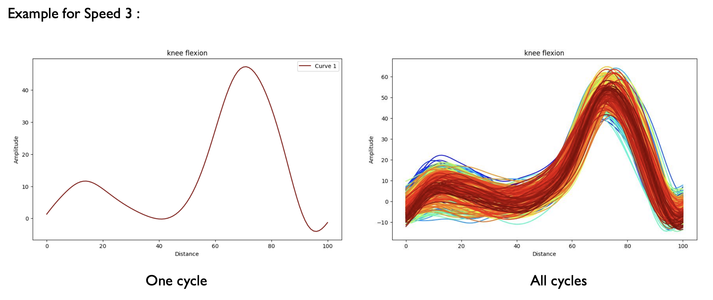
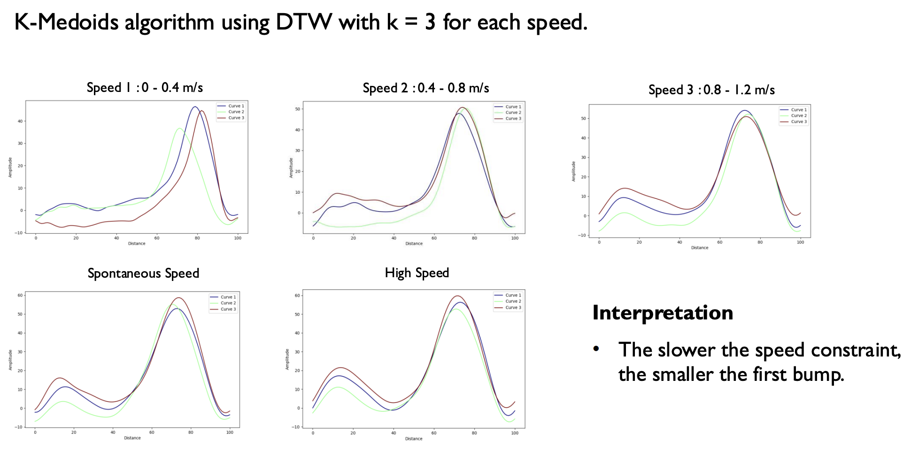
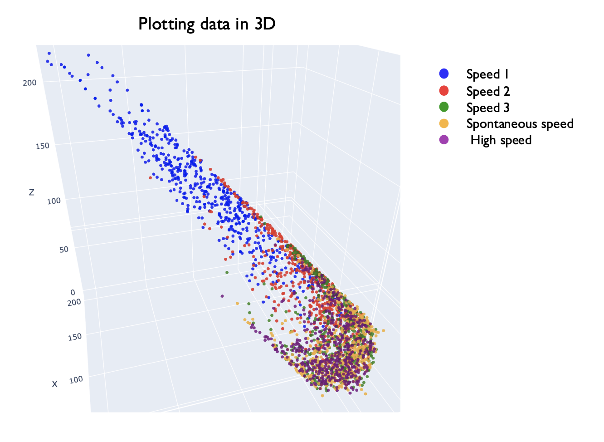
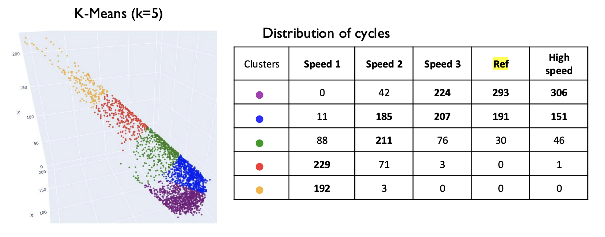

# Clinical Gait Analysis: Time-Series Clustering

This project applies unsupervised machine learning techniques to analyze clinical gait data. The goal is to investigate the impact of different walking speed constraints on human gait patterns, specifically focusing on knee flexion as a time-series.

This was a M1-level academic project for the "Artificial intelligence for data science" (SIC7002) course.

---

## Project Objective

The dataset contains 10 knee-flexion gait cycles from 52 healthy participants, each walking under 5 different speed constraints (from very slow to high speed).

**The core objective was to: Analyze the impact of these speed constraints on a person's gait, using clustering methods to segment and understand pattern changes.**

*Caption: Example of a single gait cycle (left) vs. all cycles for a given speed (right).*

---

## Methodology

My approach was a 3-step unsupervised learning pipeline:

1.  **Time-Series Clustering (K-Medoids):** I first applied **K-Medoids clustering (k=3)** directly to the time-series data for each speed group. I used **Dynamic Time Warping (DTW)** as the distance metric, which is ideal for comparing time-series that are shifted or vary in speed.

2.  **Feature Engineering (DTW Distances):** To visualize all cycles in one common space, I created a new 3D feature set. I first established a "reference gait" by finding the 3 medoids (gait patterns) of the "spontaneous speed" group. Then, I calculated the DTW distance from *every* cycle to each of these 3 reference medoids. This transformed each time-series into a 3-dimensional vector `(dist_to_medoid_1, dist_to_medoid_2, dist_to_medoid_3)`.

3.  **Cluster Analysis (K-Means):** With the data now in a 3D space, I applied a standard **K-Means algorithm (k=5)** to identify the main clusters across *all* speed groups and analyze their distribution.

---

## Key Findings & Results

### Finding 1: Gait shape deforms significantly at slow speeds.
The K-Medoids analysis showed that gait patterns are not just scaled, but their *shape* changes. Notably, the slower the speed, the smaller the first "bump" in the knee flexion curve.

*Caption: The 3 medoid (central) gait patterns found for each of the 5 speed groups.*

### Finding 2: Speed groups are clearly separable in the 3D feature space.
The 3D plot of DTW distances shows a clear separation between the different speed constraints. The slowest speeds (blue) and the reference/high speeds (red/orange) occupy distinct regions of the feature space.

*Caption: All gait cycles plotted in the 3D feature space, colored by their original speed constraint.*

### Finding 3: Slow speeds increase gait variance and "individuality."
The K-Means clustering and variance analysis provided the key insight:

* **Cycles become more individual-specific:** As seen in the table below, the slowest speeds are spread across all 5 clusters, while the reference speed (Ref) is highly concentrated in just one cluster.
* **Variance increases:** The average variance within a single person's 10 cycles is highest at the slowest speed (26.88) and lowest at high speed (8.31).

*Caption: Distribution of speed groups across the 5 K-Means clusters.*

---

## Conclusion

This analysis successfully demonstrated that gait patterns are highly sensitive to speed constraints.

The main takeaway is that **slow-speed constraints make gait patterns more distinct and individual-specific**. This suggests that in a clinical setting, asking a patient to walk slowly could be a valuable technique to **highlight and discriminate gait abnormalities** that might be hidden during a normal, "spontaneous" walk.

---

## Project Structure

├── 📁 Data/                  # Raw input data (.mat files)
│
├── 📁 Presentation/          # PDF slides
│
├── 📁 functions/             
│   ├── ACP.py                # Principal Component Analysis 
│   ├── clustering.py         # K-Means and Hierarchical clustering algorithms  
│   ├── DTW.py                # DTW implementation  
│   ├── extract_data.py       # read and parse .mat files  
│   ├── kmedoids.py           # kmedoid implementation  
│   ├── methods.py            # Utility and helper functions  
│   ├── show.py               # 
│   └── variance.py           # analysis methods  
│
├── main.py                   # Main pipeline script (entry point)
├── README.md                 
